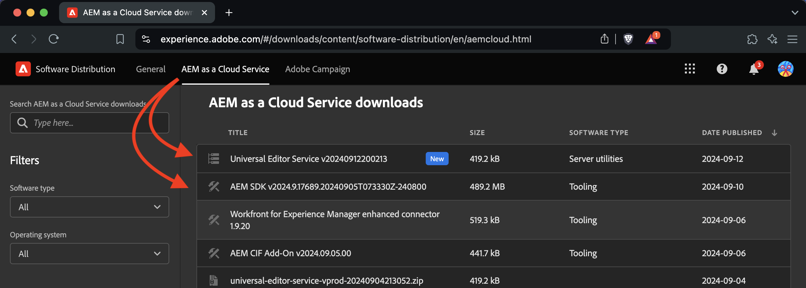

# Dev Container Features

## Software Distribution
You will need to download the required packages from [Adobe's software distribution](https://experience.adobe.com/#/downloads). The reason for this is to avoid having to keep these features up-to-date with new versions. Instead you download and place the packages in the `.devcontainer` folder. And the features will look for and unpack packages from there.

## [aem-sdk](/main/src/aem-sdk)
> Install and run AEM author, publish and dispatcher. You must have access to the AEM SDK. It is only available through the Adobe software distribution site. This feature only facilitates the setup process. See: [Developing AEM Inside a Dev Container](https://theaemmaven.com/post/developing-aem-inside-a-dev-container)

## [aem-repo-tool](/main/src/aem-repo-tool)
> Install the AEM repo tool. You will still need to setup the [key bindings](https://github.com/Adobe-Marketing-Cloud/tools/tree/master/repo) to your liking. See: [AEM Repo Tool](https://experienceleague.adobe.com/en/docs/experience-manager-cloud-service/content/implementing/developer-tools/repo-tool)

## [aem-universal-editor-service](/main/src/aem-universal-editor-service)
> Install a local Universal Editor Service. You must have access to the archive that contains the CJS file. It is only available through the Adobe software distribution site. See: [Local AEM Development with the Universal Editor](https://experienceleague.adobe.com/en/docs/experience-manager-cloud-service/content/implementing/developing/universal-editor/local-dev)
